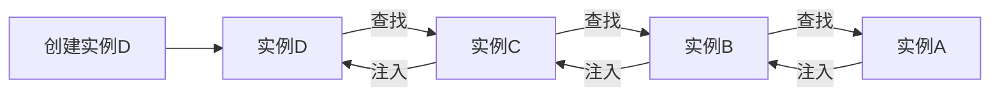
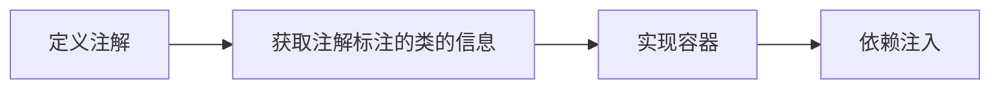

# 自研 spring 框架

**IOC对象注入方式**

- Setter 注入
- Constructor 注入
- Interface 注入
- Annotation 注入 

**IOC 容器的优势**

-  避免在各处使用new关键字创建对象，并且可以做到统一维护；

- 创建实例的时候不需要了解其中的细节；

- 反射 + 工厂模式的合体，满足开闭原则。

> 无IOC创建实例时，需要依次将对象注入到依赖此对象的对象中：

> 使用IOC创建实例时，需要依次将对象注入到依赖此对象的对象中：

**IOC 具备的基本能力**

- 解析配置
- 定位与注册对象
- 注入对象
- 提供通用的工具类

**IOC 容器实现流程**

1. 创建IOC容器需要的注解

2. 提取标记指定注解的类

   - 指定范围，获取范围内所有的类（extractPackageClass）
     - 获取类加载器
     - 通过类加载器获取到加载的资源
     - 依据不同的资源类型，采用不同的方式虎丘资源集合

   - 遍历所有类，获取被指定注解标记的类

3. 实现容器
   - 实现单例容器
   - 容器组成部分
     - 保存Class对象及其实例的载体（使用 ConcurrentHashMap 实现 Bean Map ）
     - 容器的加载
       - 配置的管理与获取
       - 获取指定范围内的Class对象
       - 依据配置提取Class对象，联通实例一同存入容器内
     - 容器的操作方式

**IOC 容器作用域**

- singleton
- prototype
- Request
- session
- globalsession